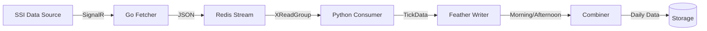

# System Architecture

## 1. High-Level Diagram

## 2. Component Details

### 2.1 Fetcher (`src/ingestion/fetcher`)
- **Technology**: Go
- **Role**: Connects to external data source (SSI) using SignalR.
- **Output**: Pushes raw JSON messages to Redis Stream `market:ticks`.
- **Backpressure**: Uses buffered channel (10k) to handle bursts; drops messages if buffer full to prevent stalling.

### 2.2 Consumer (`src/ingestion/consumer.py`)
- **Technology**: Python (Async)
- **Role**: Consumes messages from Redis Stream.
- **Processing**:
  - Parses JSON to `TickData` object.
  - Groups by `(symbol, date)`.
- **Output**: Appends to Feather files.

### 2.3 Storage (`src/ingestion/storage`)
- **Feather Format**: Columnar, efficient for time-series.
- **Path**: `data/pubsub/{symbol}/{YYYY-MM-DD}.fea`
- **Combiner**: Merges morning and afternoon sessions.

### 2.4 Core Models (`src/core`)
- **TickData**: Central dataclass defining the shape of a market tick.

## 3. Future Architecture
- **Database**: Replace/augment Feather files with PostgreSQL + TimescaleDB.
- **Bot**: Add `src/bot` module for execution and strategy.
